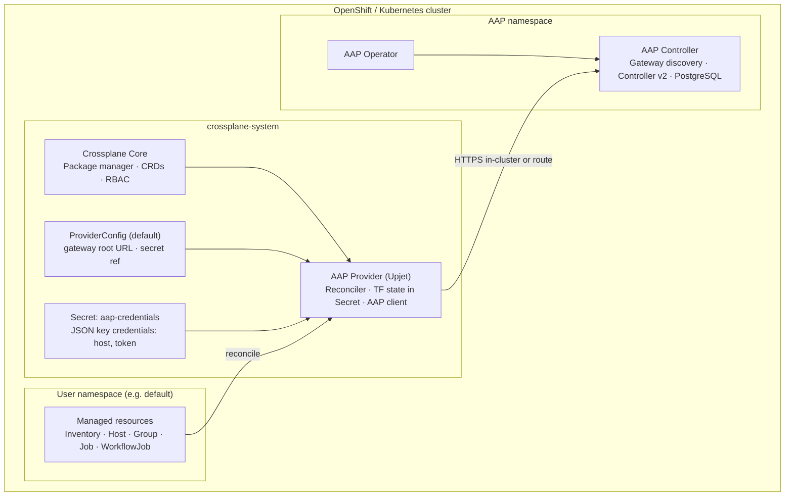
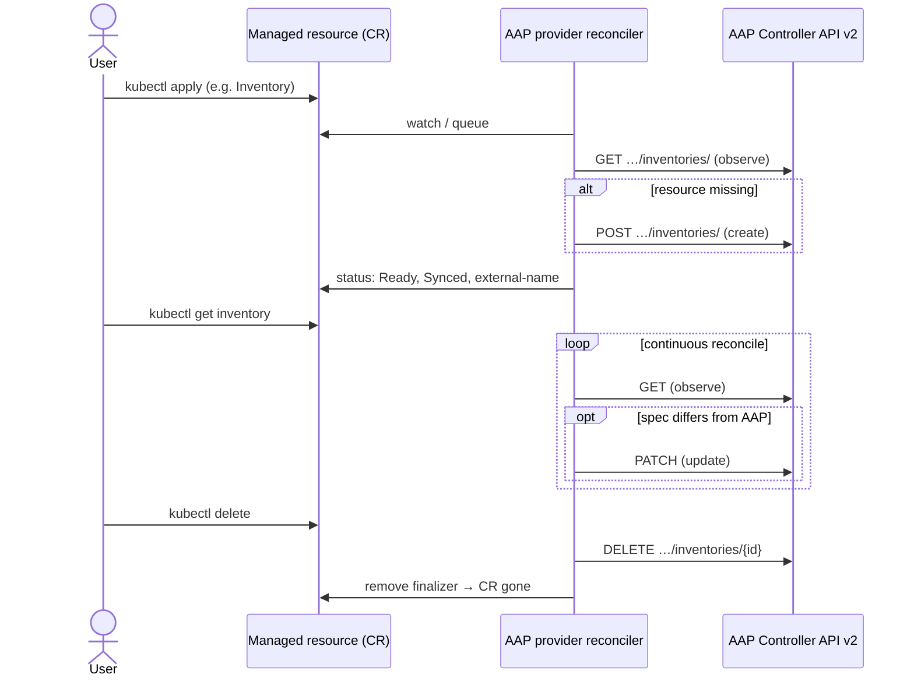
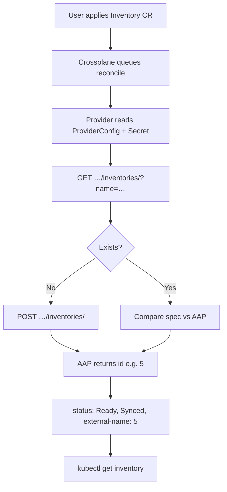

# Crossplane + AAP Integration Architecture

## High-Level Architecture



| Layer | Responsibility |
| --- | --- |
| **Crossplane Core** | Installs provider package, manages CRDs and RBAC |
| **AAP Provider** | Reconciles managed resources via Terraform/ansible-aap (Upjet) |
| **ProviderConfig + Secret** | Gateway root URL and auth (token or username/password) |
| **Managed resources** | Desired state for AAP objects (inventory, host, group, job, …) |
| **AAP Controller** | Source of truth for AAP API state |

## Reconciliation Flow



Example after create:

```text
NAME               READY   SYNCED   EXTERNAL-NAME
example-inventory  True    True     5
```

## Component Details

### 1. Crossplane Core

- Package manager for providers
- CRD lifecycle management
- RBAC and security
- Provider health monitoring

### 2. AAP Provider (Upjet-based)

- Built with Crossplane Upjet
- Wraps Terraform provider [ansible/aap](https://registry.terraform.io/providers/ansible/aap)
- Stores Terraform state in Kubernetes Secrets
- Reconciler loop: **Observe** (GET) → **Create** (POST) → **Update** (PATCH on drift) → **Delete** (DELETE)

### 3. Managed Resources

| CRD | API group | AAP endpoint (under discovered controller base) |
| --- | --- | --- |
| `Inventory` | `aap.aap.crossplane.io` | `/api/controller/v2/inventories/` |
| `Host` | `aap.aap.crossplane.io` | `/api/controller/v2/hosts/` |
| `Group` | `aap.aap.crossplane.io` | `/api/controller/v2/groups/` |
| `Job` | `job.aap.crossplane.io` | `/api/controller/v2/jobs/` |
| `WorkflowJob` | `workflowjob.aap.crossplane.io` | `/api/controller/v2/workflow_jobs/` |

Future: `JobTemplate`, `WorkflowJobTemplate`, `Project`, `Organization`. See [VALIDATE-AAP-PROVIDER-API.md](deploy/VALIDATE-AAP-PROVIDER-API.md) for the full mapping.

### 4. ProviderConfig

- `apiVersion: aap.crossplane.io/v1beta1`
- References Secret `aap-credentials` in `crossplane-system` (key `credentials`)
- `host` must be the **gateway root** (no `/api/controller` suffix)
- Auth: OAuth2/application token (recommended) or username/password

### 5. AAP Controller

- Deployed via AAP Operator (`AnsibleAutomationPlatform` CR on 2.6+)
- Discovery: `GET {gateway_root}/api/` → controller base → v2 CRUD
- PostgreSQL backend for platform state
- In-cluster: `http://<route-or-service>.<namespace>.svc`
- External: cluster Route/Ingress (e.g. `https://aap.example.com`)

## Key Concepts

### State vs. Action

- **Crossplane manages state**: “This inventory should exist with these properties.”
- **Ansible performs actions**: “Run this playbook now.”
- **Pattern**: configuration CRDs (e.g. future `JobTemplate`) vs. execution CRDs (`Job`, `WorkflowJob`). See [ADR-002-job-crd-semantics.md](adr/ADR-002-job-crd-semantics.md).

### Drift Detection

1. Observe current state in AAP (GET)
2. Compare with desired state (CR `spec`)
3. PATCH AAP if drift detected
4. Update CR `status`

### Security

- Provider ServiceAccount uses minimal RBAC
- Credentials only in Kubernetes Secrets
- Prefer scoped application tokens over admin passwords
- Provider → AAP traffic stays in-cluster when using Service DNS

## Data Flow (Inventory example)



## Future Enhancements

1. **JobTemplate / WorkflowJobTemplate** — declare templates via Crossplane
2. **Project / Organization** — broader platform scope
3. **Composition** — higher-level abstractions (e.g. application stack)
4. **Cross-namespace references** — inventory in one namespace, hosts in another
